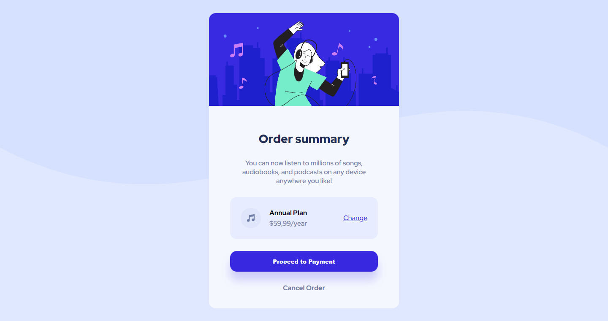

# Frontend Mentor - Order summary card solution

This is a solution to the [Order summary card challenge on Frontend Mentor](https://www.frontendmentor.io/challenges/order-summary-component-QlPmajDUj). Frontend Mentor challenges help you improve your coding skills by building realistic projects. 

## Table of contents

- [Overview](#overview)
  - [The challenge](#the-challenge)
  - [Screenshot](#screenshot)
  - [Links](#links)
- [My process](#my-process)
  - [Built with](#built-with)
  - [What I learned](#what-i-learned)
  - [Continued development](#continued-development)
  - [Useful resources](#useful-resources)
- [Author](#author)
- [Acknowledgments](#acknowledgments)

## Overview

### The challenge

Users should be able to:

- See hover states for interactive elements

### Screenshot

### Links

- Solution URL: [Add solution URL here](https://www.frontendmentor.io/solutions/simple-order-summary-component-made-with-react-4tGEuuS4Ll)
- Live Site URL: [Add live site URL here](https://master--rad-kataifi-c170a3.netlify.app/)

## My process

### Built with

- Semantic HTML5 markup
- CSS custom properties
- Flexbox
- [React](https://reactjs.org/) - JS library

### What I learned

This exercise was great for me to keep training my skills in React. The more I do this, the more I feel like I'm building my skills that I can use in the future.

### Continued development

Use this section to outline areas that you want to continue focusing on in future projects. These could be concepts you're still not completely comfortable with or techniques you found useful that you want to refine and perfect.

I want to keep improving my skills in React. Right now I'm a beginner in frontend development but have a lot of skills in other areas that I'm porting to my frontend learning. I'm sure that with my continuous learning, I'll be able to build a better portfolio and be more effective in my field and get a good job.

### Useful resources

- [Scrimba](https://www.scrimba.com) - This helped me start my FrontEnd development path. I really like the way they teach.

## Author

- Website - [Carlos Gabriel Silva Stedile](https://senatauro.github.io/)
- Frontend Mentor - [@Senatauro](https://www.frontendmentor.io/profile/senatauro)

## Acknowledgments

I want to thanks the Frontend Mentor team for creating a awesome site full of challenges and resources for new and experienced developers to keep learning and becoming better!